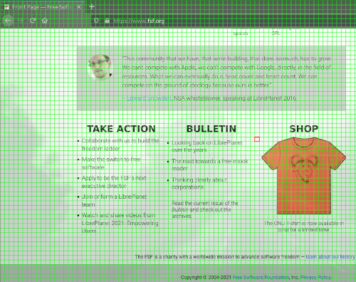

# GRIDMOUSE

Gridmouse is a mouse emulator controlled by means of the keyboard. This program renders a grid on the screen so that the user can select a point to click on.


<br>

Install xdotool:<br>
sudo pacman -S xdotool          (Arch linux)<br>
sudo apt-get install xdotool    (Debian)<br>

Compilation:
```
cd Gridmouse
make
make clean
```
<br>

Execution:
```
sudo chmod +x Gridmouse
./Gridmouse
```
<br>

### Some Considerations

Depending on the OS configuration the key pressing speed could be too slow or too fast. The next is the recommended configuration:
```
xset r rate 300 25
```

Depending on the window manager the program could required to be executed in floating mode, so that the grid takes the whole screen. On i3WM add the following line to config:
```
for_window [class="Gridmouse"] floating enable
```
<br>

## Key Controls

<strong>Up arrow:</strong> Move pointer tile upwards.<br>
<strong>Down arrow:</strong> Move pointer tile downwards.<br>
<strong>Right arrow:</strong> Move pointer tileto the right.<br>
<strong>Left arrow:</strong> Move pointer tile to the left.<br>
<strong>Enter:</strong> Do left click.<br>
<strong>Spacebar:</strong> Do right click.<br>
<strong>d:</strong> Make tiles bigger.<br>
<strong>f:</strong> Make tiles smaller.<br>
<strong>r:</strong> Put pointer tile at the top of the screen.<br>
<strong>e:</strong> Put pointer tile at the bottom of the screen.<br>
<strong>s:</strong> Put pointer tile to the leftmost column.<br>
<strong>g:</strong> Put pointer tile to the rightmost column.<br>
<strong>x:</strong> Move pointer tile to the current cursor location.<br>
<strong>q:</strong> Exit program.<br>
<br>

### Multiple Selection

Use the v key to select each of the points to click on the screen (No visual indication will be provided to this point). To execute the clicks press Enter.

## License

This software is provided under the GNU GPL v3